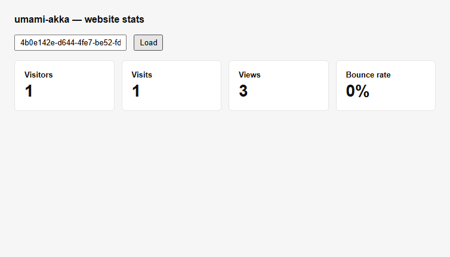

# umami-akka

Counts what visitors do on a website — which pages they open, where they came from, what they
clicked — and answers questions about it.

A rebuild of [umami-software/umami](https://github.com/umami-software/umami) on **Akka**, built
with **Akka Specify**. All of it, not a part of it: every address its interface calls, every
report, every setting, every refusal, and umami's own screens on top.



---

## Where it came from

umami is a self-hosted alternative to Google Analytics: a small script on a website sends events
to it, and a dashboard shows what came back. It was rebuilt to work out how precisely a system's
behaviour can be written down — the rebuild is the vehicle, the written-down behaviour is the
deliverable.

What it was written down from is in
[TylerJewell/akka-specify-harness](https://github.com/TylerJewell/akka-specify-harness) under
`umami-port/`.

---

## umami-software/umami → this port

📉 23,383 lines → **13,978 lines**<br>
📁 268 files → **52 files**<br>
🔌 129 addresses → **129 addresses**<br>
🎯 0 of 492 answers compared → **492 of 492 agree**<br>
🖼️ 0 of 13 screens compared → **13 of 13 compared, 8 identical**<br>
🧪 53 files of tests → **221 tests**<br>
⏱️ 12.5 → **28.7** milliseconds to answer the dashboard's main question<br>
⚡ 10.2 → **5.1** milliseconds to record one event<br>
📖 0 robot patterns of its own → **209 robot patterns**

Full method and the numbers that did *not* make this list:
[`bench/REPORT.md`](https://github.com/TylerJewell/akka-specify-harness/blob/main/umami-port/bench/REPORT.md).

---

## What it took to build

⏱️ **97.5 hours** from the first command to the published repository, **8.2** of them active<br>
💬 **2,970** exchanges with the model<br>
✍️ **2,118,107** tokens written by the model, **1,050,422,185** counting everything sent and re-sent<br>
🙋 **0** questions to a human<br>
🧪 **221** tests

```bash
python toolkit/tokens.py --port umami    # turns, tokens, elapsed and active time
```

The record of where the time went is in
[`port-log/`](https://github.com/TylerJewell/akka-specify-harness/tree/main/port-log).

---

## What it does

- **One event is one stored fact, and a fact is never changed.** Every figure the dashboard shows
  is worked out from the facts in the window each time it is asked.
- **The word "fact" here covers more than a page view.** A named event and its properties, a
  visitor's session and the things known about it, a purchase, a click position on a heatmap, a
  chunk of a recorded session, and the link between a visitor and a name they gave — each is one
  stored fact of its own kind.
- **A page view and a named event are different kinds of thing.** Three page views and one named
  event in the same visit count as three views, not four.
- **A visit with one view and nothing named is a bounce.** A filter narrows which events are
  counted, and does not change which visits bounced — so a filtered answer can show one view and
  no bounce.
- **A visitor is worked out from what the request already carries.** The address, the browser's
  own description of itself, a salt that changes daily, and a secret held by the service. Nothing
  is stored that identifies a person, and nothing is set on their machine.
- **A request from a robot is accepted and thrown away.** The sender is told everything went
  fine, and nothing is recorded.
- **Who may see what is decided per website and per section.** An account, a team membership and
  a shared link each grant a different set, and a shared link may be narrowed to one part of one
  screen.
- **The live screens are told about changes; they do not ask.** With the page open and nothing
  happening, it makes no requests at all.

---

## Design decisions

**Fact per event.** Each recorded event is stored on its own and never touched again, rather than
being added into a running total. Nothing can be counted twice by a message arriving twice, and a
question asked about last month gets the same answer today as it did then.

**Arithmetic in the program, not in the store.** The store this is built on can find rows but
cannot add them up, so the adding up is done in the program after the rows come back. Every
question umami answers can be answered without needing a second kind of storage beside the first.

**The screens are the original's own.** The pages, styling and layout are umami's files,
unchanged; only the part that fetches data was replaced. What the screens look like can therefore
be compared against the real thing rather than judged by eye — and 8 of 13 come out identical to
the pixel.

**Told rather than asked.** The two screens that show what is happening right now hold one open
connection and are sent each change, instead of asking again on a timer. A screen with nothing
happening on it costs nothing at all.

**Two kinds of stored thing, kept apart.** A recorded event is written once and only ever read as
part of a range; an account or a website is read on its own and changed rarely. Keeping them in
separate places keeps a busy website's traffic out of the index every account list walks.

**Every list arrives as it is found, not all at once.** A question about a busy week can touch
any number of records, and asking for them in one reply has a limit that a busy week goes past.
Reading them as they arrive has no limit, so there is no amount of traffic that makes a question
unanswerable.

---

## Running it — the short path

You do not need Java, Maven, or the Akka command-line tool installed. Akka Specify installs them
for you.

**1. Install Akka Specify** in Claude Code:

```
/plugin marketplace add akka/ai-marketplace
/plugin install akka@akka-ai-marketplace
```

Restart Claude Code when it asks.

**2. Give it this prompt:**

> Clone https://github.com/TylerJewell/umami-akka into a new directory and open it.
> Then run /akka:setup to install everything this project needs, and /akka:build to
> compile it, run the tests, and start it locally.

**3. Open** http://localhost:9157/api/heartbeat.

---

## Running it — the developer path

### Requirements

- Java 21 or newer
- Maven 3.9 or newer
- An Akka download token — run `akka code token` once
- Node 20 or newer, only if you want the screens as well as the service

### Start the service

```bash
mvn compile
akka local run
```

The service starts on **port 9157**. It creates one account on first start, `admin` with the
password `umami`, exactly as the original does.

### Start the screens

```bash
cd webapp
pnpm install
pnpm build
pnpm start
```

The screens start on **port 3000** and read from whatever `API_URL` in `webapp/.env.local` points
at, which is `http://127.0.0.1:9157/api` out of the box.

---

## Configuration

Every setting is read from the environment, with the same name and the same default the original
uses.

| Variable | Default | What happens when it is not set |
|---|---|---|
| `APP_SECRET` | none | A built-in value is used. Everything signed or encrypted uses this, so two deployments with different values cannot read each other's tokens. |
| `DATABASE_URL` | none | Read for its scheme only, to report which kind of store a caller is talking to. This rebuild keeps its own state. |
| `TWO_FACTOR_ENCRYPTION_KEY` | none | Every second-factor address answers 503 and the whole enrolment is unreachable — which is what the original does. It must be exactly 64 hexadecimal characters. |
| `CLIENT_IP_HEADER` | none | The visitor's address is taken from the usual forwarding headers in order instead. |
| `TRACKER_SCRIPT_NAME` | `script` | The name the tracking script is served under. |
| `COLLECT_API_ENDPOINT` | none | The tracker sends to this service. Set it to send somewhere else. |
| `DISABLE_BOT_CHECK` | unset | Robots are recorded like anyone else when this is set. |
| `DISABLE_TELEMETRY` | unset | The address that serves the usage-reporting script answers a comment instead. |
| `CLOUD_MODE` | unset | Turns on the hosted deployment's behaviour: soft deletion, the subscription lookup, and the six-month history limit. |
| `PRIVATE_MODE` | unset | Reported in the configuration a caller reads. |
| `ENABLE_TEST_CONSOLE` | unset | Reported in the configuration a caller reads. |
| `MAXMIND_DB` | none | Every event gets no country unless a hosting provider's header supplies one — which is what the published image does, because it ships no geography database. |
| `REMOVE_TRAILING_SLASH` | unset | A recorded address keeps its trailing slash. |
| `HOSTNAME` / `PORT` | `0.0.0.0` / `9157` | Where the service listens. |

---

## Where it differs from umami

Everything not listed here behaves the same way on purpose, including the parts that look like
mistakes.

- **The live screens are sent changes instead of asking for them.** umami asks again every ten
  seconds for the live screen and every sixty for the visitor count in the header. This rebuild
  holds one open connection per screen and is sent the whole current answer whenever it changes,
  because a screen showing what is happening now should not be up to ten seconds behind. What a
  caller can see is genuinely different: asking again always fetches the current state and so
  misses nothing, while a connection that drops misses whatever happened while it was down. This
  rebuild answers that by sending the whole current state as the first thing on every new
  connection, so a screen that reconnects catches up rather than replaying what it missed. umami
  never had to decide this, because something that asks again never has to.
- **A live screen proves who it is in the address, not in a header.** A browser's way of holding
  an open connection cannot send headers, so the two addresses that serve one accept the sign-in
  token and the shared-link token in the address itself. No other address does — a token in an
  address ends up in server logs and in the address of whatever page is opened next, and this
  rebuild pays that only where there is no alternative. umami has no such addresses.
- **A recorded event takes a moment to appear in an answer.** umami records and reads in one
  step, so a question asked immediately after an event already counts it. Here the event is
  stored at once and the index that answers questions is brought up to date just afterwards, so
  the same question asked in the same instant can give the older number. Bringing 200 events into
  view took 26.0 milliseconds on umami and 1,414.5 on this rebuild. Everything that reads is
  eventually right; nothing is lost.
- **Two named events with the same count in the same time bucket come back in a different
  order.** umami's query for that chart sorts by the time bucket only, so which of two names in
  one bucket comes first is left to its store; on the run this was found, umami's own two
  addresses for the same information disagreed with each other. This rebuild sorts by count in
  both, so the same question always gives the same order. The chart colours the series by
  position, so this is visible.
- **A funnel nobody entered leaves both of its proportions empty.** umami divides by the first
  step's visitor count without checking it, which produces no number at all when that count is
  zero, and its answer carries that as nothing. This rebuild does the same rather than writing a
  zero, because a zero would say the step lost everyone, which is a different claim from having
  had nobody to lose.
- **An address whose filter cannot be built answers with an ordinary error message.** Giving a
  comparison to a field that has no such comparison leaves umami's query half-built, and it
  answers 500 with an empty body. This rebuild answers 500 with the error body every other
  failure uses, because a caller reading a body should not have to handle one address that sends
  none. The status is the same.
- **The single-sign-on exchange works.** umami needs a cache alongside its database for that one
  address and answers 500 saying so when there is none. This rebuild's session store is always
  there, so the address does what it is for.
- **Only one kind of storage.** umami can be pointed at a second kind of store for analytics, with
  an optional queue in front of its writes and an optional cache beside both. This rebuild
  implements the behaviour once, matching the one the published deployment runs. Where the choice
  is visible to a caller it matches that one: deleting a visitor's sessions is available and is
  reported as available.
- **Nothing is reported back to umami.** umami's own build reports each build to its makers, and
  its dashboard checks their service for a newer version and for a subscription record. This
  rebuild serves the address that hands out the usage-reporting script and honours the setting
  that disables it, and reports nothing about itself. A deployment of umami that cannot reach
  their service behaves the same way.
- **No country unless something supplies one.** Both are the same here and both depend on setup:
  the published umami image ships no geography database, so it answers no country for every event
  unless a hosting provider's header carries one. This rebuild reads the same five headers and
  the same database when one is configured.
- **Screens: five regions of thirteen screens differ, all declared.** The column showing how long
  ago something was created reads as a duration from the moment the picture was taken, and the
  two pictures are taken minutes apart. The live chart's axis ends at the moment the picture was
  taken. The visitor faces are drawn from the visitor identifier, which each deployment works out
  with its own secret. The website identifier and the tracking code contain that identifier and
  the address the script is served from. And the stacking order of two event series, above. The
  other eight screens are identical to the pixel.
- **Reading a window costs more here, and how much more depends on how much is in it.** umami
  selects and adds up in one instruction to its database; this rebuild reads the window's records
  back and adds them up itself, because the store it is built on can find records but cannot add
  them up. Answering the dashboard's main question over two hundred page views took 12.5
  milliseconds on umami and 28.7 here. Recording an event is twice as fast here, and answering
  with a fixed value is nearly four times as fast. These figures move by a third between runs on
  a machine that is doing other things, so what they support is the shape of the difference
  rather than the exact ratio.
- **Not checked: behaviour with more than a few thousand records in one window, under load, over
  long periods, or with more than one caller at a time.** The largest window either system was
  asked about here holds 2,000 recorded page views, and everything above that is unmeasured. This
  is worth reading carefully: the one time this rebuild was asked about a window larger than it
  had been asked about before, it turned out to answer nothing at all until that was fixed.
- **Not checked: what happens when the machine running it is interrupted.** Neither system was
  stopped and restarted mid-write during any comparison.

---

## Licence

umami-software/umami is MIT-licensed, © 2022 Umami Software, Inc. This rebuild **contains
umami's own source**: `webapp/` is umami's front end, 1,295 of 1,313 shared files byte-for-byte
identical, and `src/main/java/io/akka/umami/lib/Bots.java` holds 209 patterns taken from the
MIT-licensed `isbot` package. This repository therefore carries umami's licence and copyright
notice in `LICENSE`. Everything else under `src/main/java` is written here. See
[`ACKNOWLEDGEMENTS.md`](ACKNOWLEDGEMENTS.md), which accounts for all 339 pieces of text the two
share.
